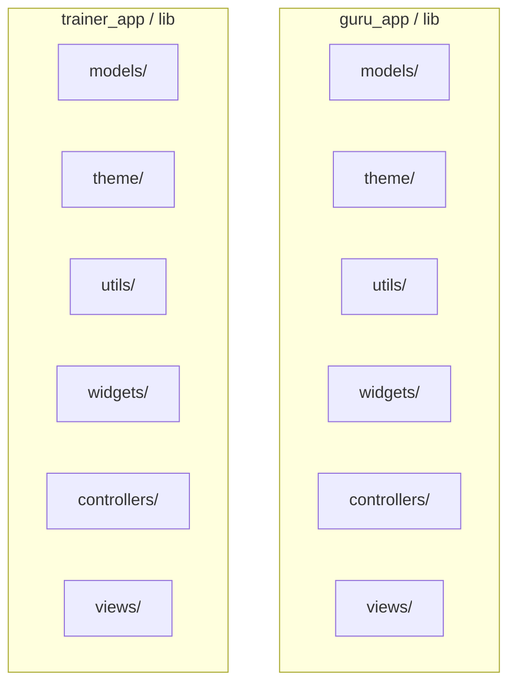

# Technical Architecture Specification

High-level architectural structure of the standalone decoupled Guru & Trainer Pulse applications.

---

## Standalone Decoupled Architecture

In compliance with the requirement of keeping the applications completely separate and independent (*"do not make shared ones thing make it saperate things"*), all shared package links have been removed. Both apps are fully self-contained, modular, and can be compiled or transported individually.



---

## MVC Folder Structure & Flow

Each Flutter application implements a clean **Model-View-Controller** structure under its `lib/` directory:

```
lib/
├── theme/            # Local visual tokens (AppColors, AppTypography, AppSpacing, CustomThemeExtension)
├── models/           # Local strongly-typed data models (User, Message, CallRequest, SessionLog, RoomMeta)
├── utils/            # Local utilities (AppLogger, Validators)
├── widgets/          # Local custom visual widgets (PrimaryButton, ChatBubble, CustomAppBar, AppTextField, skeletons)
├── controllers/      # GetX Controllers (Business Logic & Sockets Handshakes)
├── views/            # Screen Views (Reuses local custom widgets & theme settings)
└── main.dart         # DI injections and app bootstrapper
```

### Flow Pattern (GetX MVC)
1. **View (UI)**: Listens to reactive observables (`obs`) from Controllers using `Obx` widgets. Dispatches user gestures to Controller methods.
2. **Controller (Logic)**: Handles input validations, updates local storage, logs metrics inside `AppLogger`, and broadcasts payloads via local WebSockets.
3. **Model (Data)**: Defines strongly-typed entities with `.fromJson()` and `.toJson()` methods for persistence and socket transmissions.

---

## Real-Time WebSockets Sync Mechanics

```
  +-----------------------+              Local WebSocket Link             +------------------------+
  |  Guru App (Member)    | <===========================================> | Trainer App (Server)   |
  |  - WebSocket Client   |             `ws://localhost:8080/ws`          | - WebSocket Server     |
  |  - Storage Controller |                                               | - Storage Controller   |
  |  - Chat Controller    |                                               | - Chat Controller      |
  +-----------------------+                                               +------------------------+
              ^                                                                       ^
              |                                                                       |
              |                                                                       |
              +------------------------- HTTP GET /token -----------------------------+
```

1. **Active Handshake**:
   - Trainer App boots up and binds `HttpServer` to port `8080`.
   - Guru App connects, triggering the Trainer App to send an initial `sync_init` payload containing all current chats, booking requests, and session diaries cached in GetStorage.
2. **Bi-directional Chats**:
   - Member dispatches message -> Guru Socket Client sends JSON over WS -> Trainer Server receives, saves to database, echos read ticks -> both interfaces render checkmarks reactively.
3. **Call Rooms Coordination**:
   - Member schedules slot -> slots conflicts check verifies overlap -> request saved as pending -> approved by Trainer -> Trainer posts automated chat notification and opens video call join gate -> both clients enter split grid video screens together.
